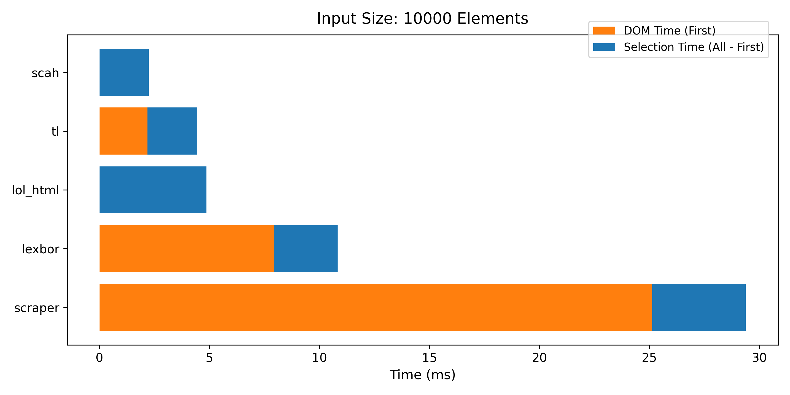

# scah (scan HTML)
World's fastest CSS Selector.

## Benchmark's

### Native

### Python Bindings for scah Benchmark's
Real Html BenchMark ([html.spec.whatwg.org](https://html.spec.whatwg.org/)) (select all `a` tags):

Synthetic Html BenchMark (select all `a` tags):

