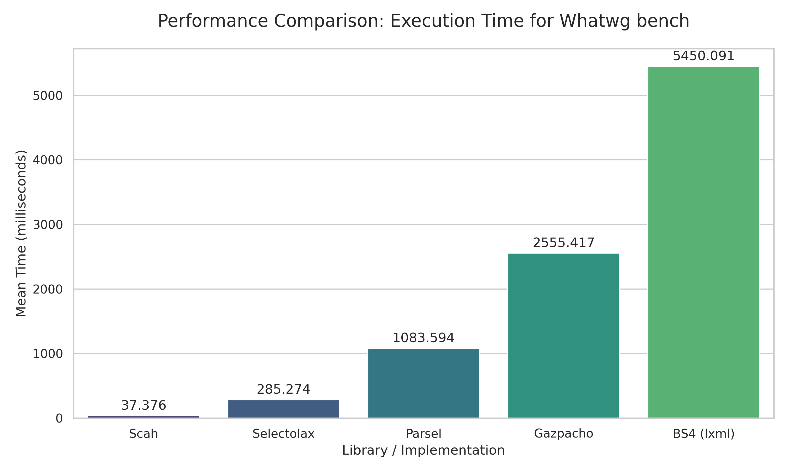
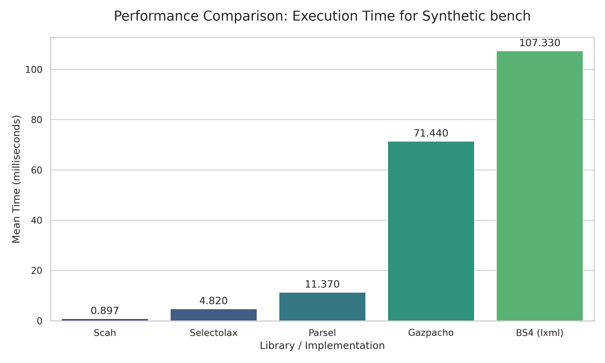

# scah (scan HTML)
World's fastest CSS Selector.

> CSS selectors meet streaming XML/HTML parsing. Filter StAX events and build targeted DOMs without loading the entire document.

[](https://crates.io/crates/scah)
[](https://www.npmjs.com/package/scah)
[](https://pypi.org/project/scah/)

## What is scah?

**scah** is a high-performance parsing library that bridges the gap between SAX/StAX streaming efficiency and DOM convenience. Instead of loading an entire document into memory or manually tracking parser state, you declare what you want with **CSS selectors**; the library handles the streaming complexity and builds a targeted DOM containing only your selections.

- **Streaming core**: Built on StAX; constant memory regardless of document size
- **Familiar API**: CSS selectors (including combinators like `>`, ` `, `+` (coming soon), `~` (coming soon))
- **Multi-language**: Rust core with Python and TypeScript/JavaScript bindings
- **Composable queries**: Chain selections and nest them with closures for **structured querying**; not only more efficient than flat filtering, but a fundamentally better pattern for extracting hierarchical data relationships

## Quick Start

### Rust
```rust
use scah::{Query, Save, parse};

let query = Query::all("main > section", Save::all())
    .then(|section| [
        section.all("> a[href]", Save::all()),
        section.all("div a", Save::all()),
    ])
    .build();

let store = parse(html, &[query]);
```

#### Benchmark's


### Python
```python
from scah import Query, Save, parse 

query = Query.all("main > section", Save.all())
    .then(lambda section: [
        section.all("> a[href]", Save.all()),
        section.all("div a", Save.all()),
    ])
    .build()

store = parse(html, [query])
```

#### Benchmark's
##### Real Html BenchMark ([html.spec.whatwg.org](https://html.spec.whatwg.org/)) (select all `a` tags):


##### Synthetic Html BenchMark (select all `a` tags):


### Typescript / Javascript
```ts
import { Query, parse } from 'scah';

const query = Query.all('main > section', { innerHtml: true, textContent: true })
  .then((p) => [
    p.all('> a[href]', { innerHtml: true, textContent: true }),
    p.all('div a', { innerHtml: true, textContent: true }),
  ])
  .build();

const store = parse(html, [query]);
```