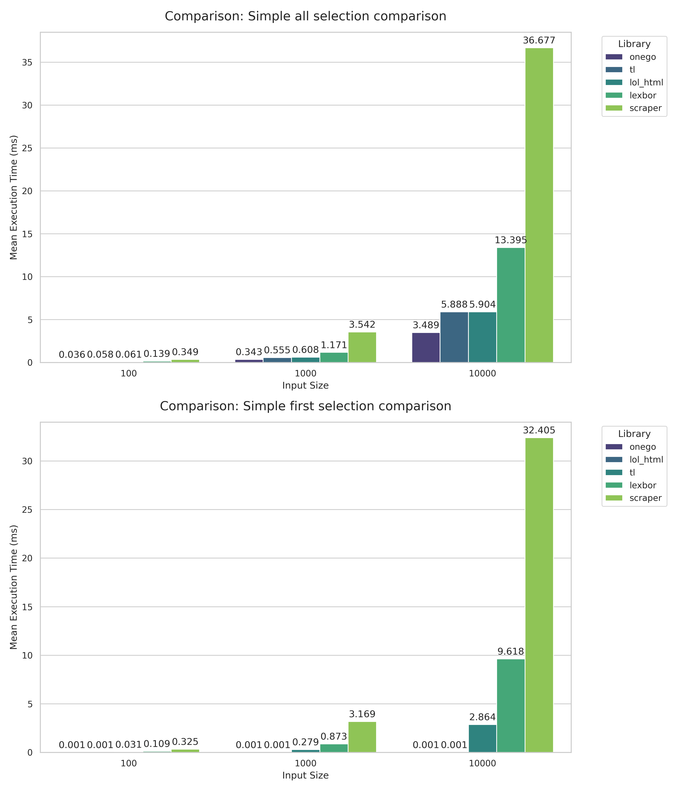

# Performance Benchmark Report

## Simple All Selection Comparison

### Input Size: 100 Elements

| Library | Min (ms) | StdDev (ms) |
| :--- | :--- | :--- |
| onego | **0.022046** | 0.000185 |
| tl | **0.046224** | 0.000432 |
| lol_html | **0.058586** | 0.000695 |
| lexbor | **0.112157** | 0.001393 |
| scraper | **0.303718** | 0.003815 |

### Input Size: 1000 Elements

| Library | Min (ms) | StdDev (ms) |
| :--- | :--- | :--- |
| onego | **0.216645** | 0.002470 |
| tl | **0.461832** | 0.004459 |
| lol_html | **0.575337** | 0.006590 |
| lexbor | **0.940750** | 0.010062 |
| scraper | **3.045186** | 0.014250 |

### Input Size: 10000 Elements

| Library | Min (ms) | StdDev (ms) |
| :--- | :--- | :--- |
| onego | **2.131715** | 0.010926 |
| tl | **4.511841** | 0.023197 |
| lol_html | **5.638339** | 0.025953 |
| lexbor | **9.902574** | 0.049035 |
| scraper | **30.423799** | 0.133665 |

---

## Simple First Selection Comparison

### Input Size: 100 Elements

| Library | Min (ms) | StdDev (ms) |
| :--- | :--- | :--- |
| onego | **0.000583** | 0.000007 |
| lol_html | **0.001383** | 0.000017 |
| tl | **0.023043** | 0.000318 |
| lexbor | **0.088720** | 0.001427 |
| scraper | **0.271654** | 0.003109 |

### Input Size: 1000 Elements

| Library | Min (ms) | StdDev (ms) |
| :--- | :--- | :--- |
| onego | **0.000582** | 0.000006 |
| lol_html | **0.001501** | 0.000058 |
| tl | **0.229986** | 0.002469 |
| lexbor | **0.698619** | 0.008466 |
| scraper | **2.710535** | 0.012126 |

### Input Size: 10000 Elements

| Library | Min (ms) | StdDev (ms) |
| :--- | :--- | :--- |
| onego | **0.000580** | 0.000006 |
| lol_html | **0.001416** | 0.000014 |
| tl | **2.222701** | 0.016582 |
| lexbor | **7.328258** | 0.047419 |
| scraper | **27.170458** | 0.159519 |

---

