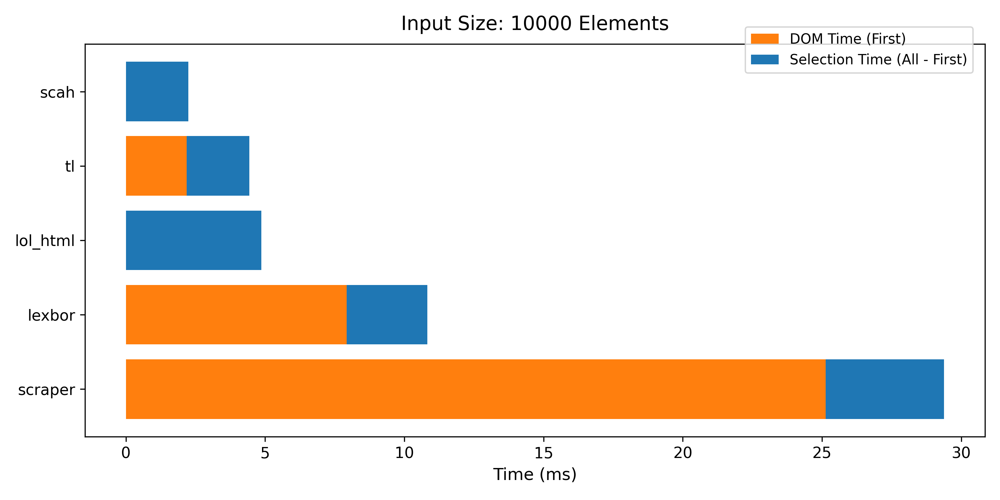

# Performance Benchmark Report

## Simple All Selection Comparison

### Input Size: 100 Elements

| Library | Mean (ms) |
| :--- | :--- |
| scah | **0.033199** 
| tl | **0.044361** 
| lol_html | **0.048039** 
| lexbor | **0.117052** 
| scraper | **0.287948** 

### Input Size: 1000 Elements

| Library | Mean (ms) |
| :--- | :--- |
| scah | **0.326177** 
| tl | **0.457205** 
| lol_html | **0.470112** 
| lexbor | **1.029022** 
| scraper | **2.900244** 

### Input Size: 10000 Elements

| Library | Mean (ms) |
| :--- | :--- |
| scah | **3.552618** 
| tl | **4.446345** 
| lol_html | **4.661869** 
| lexbor | **11.075140** 
| scraper | **28.933025** 

---

## Simple First Selection Comparison

### Input Size: 100 Elements

| Library | Mean (ms) |
| :--- | :--- |
| scah | **0.000596** 
| lol_html | **0.001129** 
| tl | **0.020601** 
| lexbor | **0.092543** 
| scraper | **0.255089** 

### Input Size: 1000 Elements

| Library | Mean (ms) |
| :--- | :--- |
| scah | **0.000597** 
| lol_html | **0.001124** 
| tl | **0.224714** 
| lexbor | **0.786608** 
| scraper | **2.553527** 

### Input Size: 10000 Elements

| Library | Mean (ms) |
| :--- | :--- |
| scah | **0.000589** 
| lol_html | **0.001129** 
| tl | **2.141791** 
| lexbor | **8.308555** 
| scraper | **25.525014** 

---