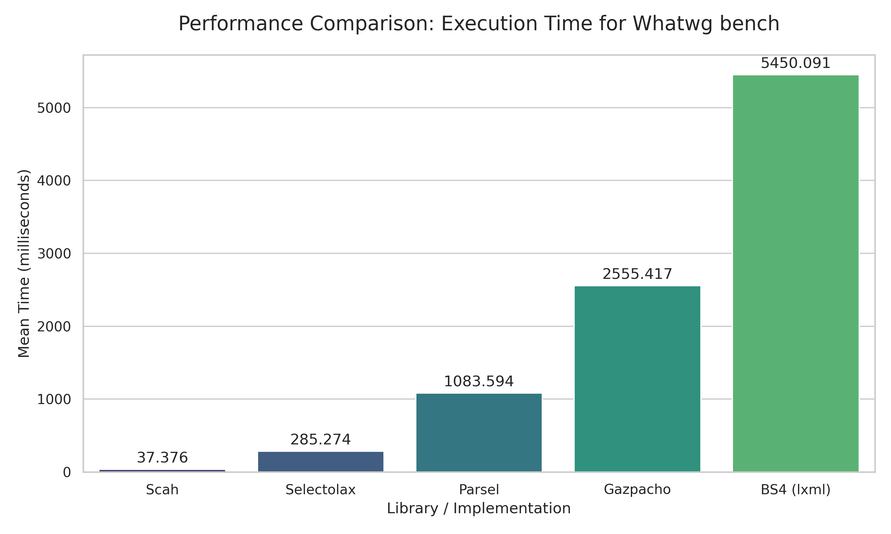
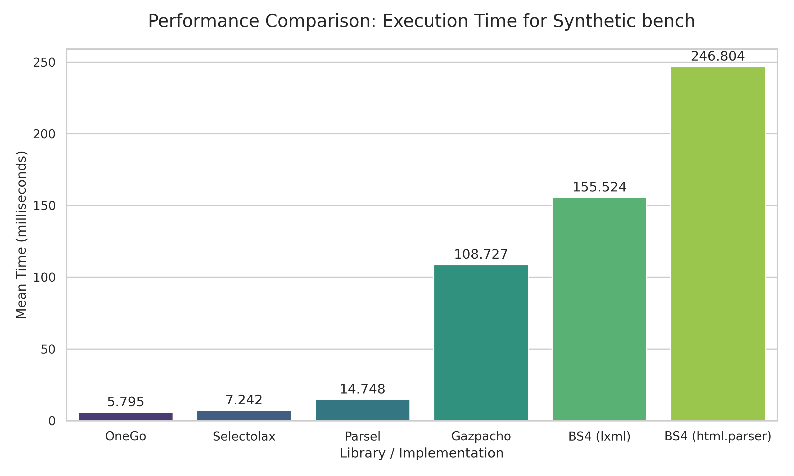

# Python Bindings for scah

## Benchmark
Real Html BenchMark ([html.spec.whatwg.org](https://html.spec.whatwg.org/)) (select all `a` tags):


Synthetic Html BenchMark (select all `a` tags):


### Run benchmarks
```bash
uv venv
source .venv/bin/activate
uv run --all-extras poe bench
```